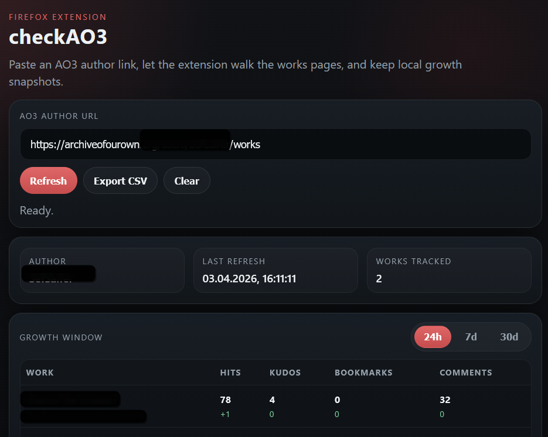

# checkAO3

`checkAO3` is a Firefox extension for tracking AO3 author work stats without opening individual work pages.

## What the extension does

- accepts any AO3 author URL
- normalizes it to `/users/<name>/works`
- walks author work pages one by one
- reads stats from listing pages only
- stores local history in Firefox storage
- shows current stats plus growth for `24h`, `7d`, or `30d`
- exports the current table as CSV

## Requirements

- Firefox desktop
- a local copy of this repository
- access to public AO3 author pages

## How to run the extension in Firefox

### First launch

1. Open Firefox.
2. Type `about:debugging#/runtime/this-firefox` into the address bar and press Enter.
3. On the `This Firefox` page, click `Load Temporary Add-on`.
4. In the file picker, open the project folder:
   `d:\projects\checkAO3`
5. Select [manifest.json](d:\projects\checkAO3\manifest.json).
6. Firefox will load the extension temporarily.

After that, the extension should appear in the Firefox extensions list and in the extensions menu.

### How to open the popup

1. In Firefox, click the puzzle-piece icon in the top-right toolbar.
2. Find `checkAO3` in the extensions list.
3. Click `checkAO3` to open the popup.
4. If you want faster access, pin the extension to the toolbar from the same menu.

## How to use the extension

1. Open the popup.
2. Paste an AO3 author URL into the input field.
   Example:
   `https://archiveofourown.org/users/username/works`
3. Click `Refresh`.
4. Wait while the extension walks the author's works pages.
5. The table will fill with current stats for each work.
6. Use the `24h`, `7d`, and `30d` buttons to switch the growth window.
7. Click `Export CSV` if you want to save the current table.

## Screenshot

Example popup view with sensitive AO3 identifiers redacted:



## How growth values work

The extension stores snapshots locally and compares the newest snapshot with an older one.

- On the first refresh, you only get current stats.
- If there is no older snapshot yet, growth shows `-`.
- As soon as you have at least two snapshots, the extension starts showing changes.
- For each selected window (`24h`, `7d`, `30d`), the extension uses the earliest available snapshot inside that window.
- If there is no snapshot inside the full window yet, it falls back to the earliest older snapshot you do have.

This means growth can start showing immediately after the second refresh, even if a full 24 hours have not passed yet.

Example:

- first refresh: `77`, growth is `-`
- second refresh a few minutes later: `78`, growth can show `+1`
- after more snapshots over time: `7d` and `30d` become more representative

## How to reload the extension after code changes

Firefox temporary add-ons do not always update automatically when you edit files.

To reload the extension:

1. Open `about:debugging#/runtime/this-firefox`
2. Find `checkAO3`
3. Click `Reload`
4. Close the popup if it is open
5. Open the popup again

Do this every time after changing HTML, CSS, or JavaScript.

## How to remove and install again

If something looks stale or broken, reinstall the extension cleanly.

1. Open `about:debugging#/runtime/this-firefox`
2. Find `checkAO3`
3. Click `Remove`
4. Click `Load Temporary Add-on`
5. Select [manifest.json](d:\projects\checkAO3\manifest.json) again

## How to verify that it works

A quick smoke test:

1. Load the extension.
2. Open the popup.
3. Paste a public AO3 author URL.
4. Click `Refresh`.
5. Check that:
   - the author name appears
   - `Works tracked` is greater than `0`
   - the table shows work titles and current stats
   - growth values show `-`, `0`, or signed numbers such as `+1`

## Troubleshooting

### The popup opens but nothing happens

- Make sure the URL is from `https://archiveofourown.org`
- Try a public author page
- Click `Refresh` again
- Check that Firefox still has the temporary add-on loaded

### The popup still shows an old design or old behavior

- Open `about:debugging#/runtime/this-firefox`
- Click `Reload` for `checkAO3`
- Reopen the popup

### I see `-` under growth values

That is expected when there is not enough history yet.

### The extension disappears after restarting Firefox

That is expected for a temporary add-on.
You need to load [manifest.json](d:\projects\checkAO3\manifest.json) again after Firefox restarts.

### I want to inspect errors

1. Open `about:debugging#/runtime/this-firefox`
2. Find `checkAO3`
3. Click `Inspect`
4. Look at the console for popup or background errors

## Testing

Run the snapshot-history tests locally with:

```bash
node --test tests/*.test.js
```

This project includes generated snapshot cases for delta calculation, window boundaries, unchanged refreshes, and duplicate timestamp protection.

## Current development state

- optimized for public author work pages
- uses one selected growth window at a time in the popup
- does not handle AO3 login flows inside the extension UI
- stores data only in the local Firefox profile
- growth values depend on how many snapshots you already collected locally

## Notes

This extension is not registered for regular Firefox distribution yet and is currently intended to run only as a temporary add-on in Firefox debug mode.

## Legal and policy note

- AO3 policy is separate from the source-code license
- this project is unofficial and is not affiliated with AO3 or OTW
- see [NOTICE.md](d:\projects\checkAO3\NOTICE.md) for the AO3-specific notice

## Project structure

- [manifest.json](d:\projects\checkAO3\manifest.json): Firefox extension manifest
- [popup/popup.html](d:\projects\checkAO3\popup\popup.html): popup markup
- [popup/popup.css](d:\projects\checkAO3\popup\popup.css): popup styling
- [popup/popup.js](d:\projects\checkAO3\popup\popup.js): popup rendering and CSV export
- [background/background.js](d:\projects\checkAO3\background\background.js): page walking and snapshot saving
- [content/ao3-parser.js](d:\projects\checkAO3\content\ao3-parser.js): AO3 page parser
- [lib/dates.js](d:\projects\checkAO3\lib\dates.js): formatting and delta calculations
- [lib/storage.js](d:\projects\checkAO3\lib\storage.js): local Firefox storage helpers
- [docs/images/popup-redacted.png](d:\projects\checkAO3\docs\images\popup-redacted.png): redacted popup screenshot
